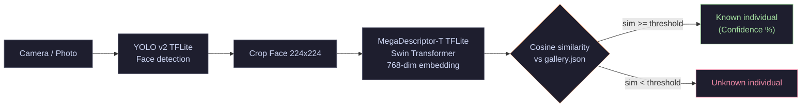

# OrangIdentifier - Android App


**Individual facial recognition for Bornean orangutans.** 
Offline Android companion app to the [OrangIdentifier ML Pipeline](https://github.com/tit-exe/OrangIdentifier).

---

## Overview

The OrangIdentifier app provides offline individual identification of Bornean orangutans for field rangers. It is developed natively in Android Studio.

It uses a YOLO v2 face detector and a MegaDescriptor backbone to match faces against a JSON gallery using cosine similarity.

New individuals can be added directly in the app by taking photos. The facial embeddings are extracted and saved to the local gallery without retraining.

### Model V3 Characteristics
The V3 MegaDescriptor model is optimized for **open-set recognition**. It reliably rejects unknown individuals not present in the gallery.

**Trade-offs:** Accuracy may decrease under degraded conditions such as low lighting, high JPEG compression, or motion blur.


## Features

- **Offline Inference**: Uses on-device TensorFlow Lite models. No internet connection required.
- **Real-time Identification**: Camera feed processing with confidence scores and top-3 predictions.
- **Media Processing**: Analyze photos and videos from the Android gallery.
- **Gallery Management**: Add new individuals or update existing ones directly from the app.
- **Real-time Correction**: Manually correct wrong predictions to update the individual's prototype vector on the fly.
- **Scan History**: Local Room database logging past identifications.

## Screenshots

| Home & Camera | Identification Result | Identity Gallery |
|:---:|:---:|:---:|
|  |  |  |

---

## Technical Architecture

- **Language**: Kotlin
- **Architecture**: MVVM + Clean Architecture
- **Dependency Injection**: Hilt
- **Local Database**: Room
- **Machine Learning**: TensorFlow Lite Android Support
- **Camera**: CameraX
- **Navigation**: Jetpack Navigation Component
- **Concurrency**: Kotlin Coroutines & Flow (`Dispatchers.IO` for inference)

---

## Inference Pipeline



---

## Models & Gallery Download

This application requires specific ML models and a gallery JSON file. 

All required `.tflite` models and `gallery.json` are hosted on a dedicated HuggingFace repository:
> **[Link to your HuggingFace repo here]** *(e.g., huggingface.co/tit-exe/OrangIdentifier-Android-Assets)*

### Files to place in `app/src/main/assets/`
Download the following files and place them in the `app/src/main/assets/` folder:
1. `gallery.json` : Identity prototypes database.
2. `yolo_v2_detector.tflite` : YOLO face detector model.
3. `megadesc_T_arcface_backbone.tflite` : MegaDescriptor-T embedding backbone.

*Note: `yolo_v2_detector.tflite` is included in this repository. The backbone model (112MB) exceeds GitHub's file size limits and must be downloaded.*

---

## Build Instructions

1. Clone this repository:
   ```bash
   git clone https://github.com/tit-exe/OrangIdentifier-Android.git
   ```
2. Download `megadesc_T_arcface_backbone.tflite` and `gallery.json` from the HuggingFace repo.
3. Place them in `app/src/main/assets/`.
4. Open the project in Android Studio.
5. Sync the Gradle files.
6. Build and run the application.
