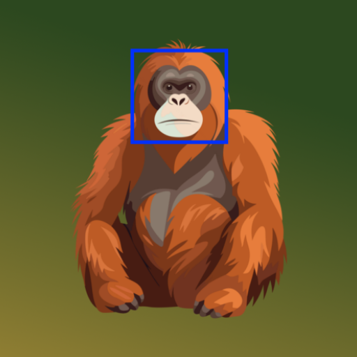
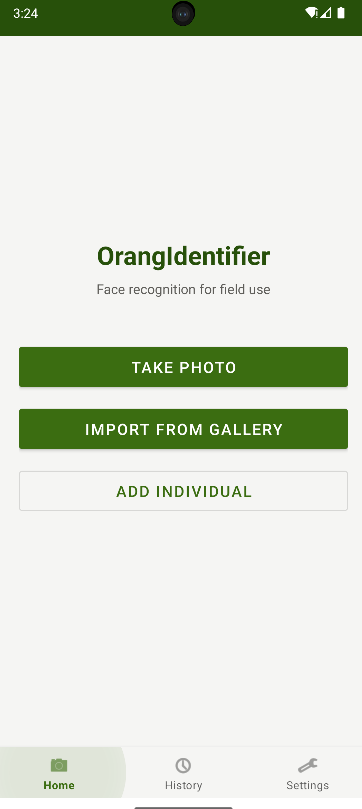
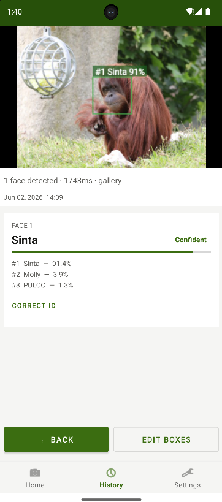
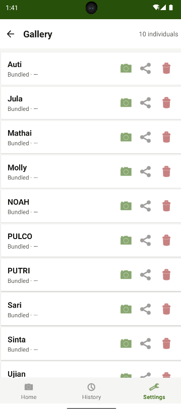
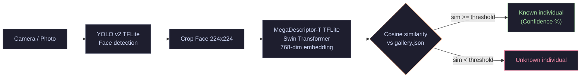

# OrangIdentifier - Android App



**Individual facial recognition for Bornean orangutans on the edge.** 
This is the offline Android companion app to the [OrangIdentifier ML Pipeline](https://github.com/tit0000/OrangIdentifier).

---

## Overview

Developed natively in **Android Studio**, the OrangIdentifier app empowers field rangers to photograph primates and obtain automatic individual identification in seconds, entirely offline. 

This app runs the **V3 pipeline** under the hood: a YOLO v2 face detector paired with a **MegaDescriptor** backbone. This state-of-the-art architecture allows the app to perform incredibly fast similarity matching using cosine distance against a lightweight JSON gallery of known individuals.

Crucially, **adding a new individual is easy and instantaneous**: the ranger simply takes a few pictures of the new orangutan, the app extracts the facial embeddings, and the new identity is immediately saved to the local gallery without any retraining required.

### V3 Model Strengths & Trade-offs
The V3 MegaDescriptor model is specifically optimized for **open-set recognition**. This means it is incredibly robust at detecting **unknown individuals** (rejecting orangutans that are not in the gallery). 
As a trade-off for this high rejection accuracy, the model can be slightly more sensitive to degraded conditions: recognition accuracy may drop if the image is too dark, highly compressed (JPEG artifacts), or noticeably blurry.

---

## Demo


> Identifying individuals from live camera feed and saved gallery images.

---

## Features

- **Fully Offline**: 100% local processing using on-device TensorFlow Lite models. No internet connection or cloud API is needed.
- **Easy Identity Onboarding**: Register new orangutans into the system directly from the app in less than a minute.
- **Real-time Identification**: Point the camera to get live predictions with confidence scores and top-3 hypotheses.
- **Media Processing**: Analyze existing photos and videos from your Android gallery.
- **Continuous Learning**: Rangers can manually correct wrong predictions in real-time, which updates and improves the individual's prototype vector on the fly.
- **Scan History**: Keep track of all past identifications with a robust local SQLite database.

## Screenshots

| Home & Camera | Identification Result | Identity Gallery |
|:---:|:---:|:---:|
|  |  |  |

---

## Technical Architecture

The app is built using modern Android development practices and Jetpack components:

- **Language**: Kotlin
- **Architecture**: MVVM (Model-View-ViewModel) + Clean Architecture
- **Dependency Injection**: Hilt
- **Local Database**: Room
- **Machine Learning**: TensorFlow Lite Android Support
- **Camera**: CameraX
- **Navigation**: Jetpack Navigation Component
- **Concurrency**: Kotlin Coroutines & Flow (all heavy ML inference runs on `Dispatchers.IO`)

---

## Inference Pipeline

The app executes a highly optimized version of the Python pipeline using TensorFlow Lite:



---

## Models & Gallery Download

This application requires specific ML models and a gallery JSON file to be present in the `app/src/main/assets/` directory before building.

All required `.tflite` models and the `gallery.json` are hosted on a dedicated HuggingFace repository:
> **[Link to your new HuggingFace repo here]** *(e.g., huggingface.co/tit0000/OrangIdentifier-Android-Assets)*

### Files to place in `app/src/main/assets/`
You must download the following 3 files and place them exactly in the `app/src/main/assets/` folder:
1. `gallery.json` : The database containing the identity prototypes.
2. `yolo_v2_detector.tflite` : The YOLO face detector model.
3. `megadesc_T_arcface_backbone.tflite` : The MegaDescriptor-T embedding backbone.

*Note: The `yolo_v2_detector.tflite` is already included in this repository because it is small enough, but the backbone model (112MB) exceeds GitHub's file size limits.*

---

## Building the App

1. Clone this repository:
   ```bash
   git clone https://github.com/tit0000/OrangIdentifier-Android.git
   ```
2. Download `megadesc_T_arcface_backbone.tflite` (and your custom `gallery.json`) from the HuggingFace repo.
3. Place them in the `app/src/main/assets/` directory.
4. Open the project in **Android Studio** (Koala or newer recommended).
5. Sync the Gradle files.
6. Hit **Run** to build and install the app on your physical device or emulator.
