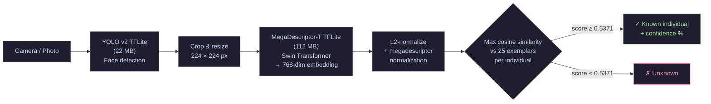

# OrangIdentifier: Android App (V6)


[](https://developer.android.com)
[](https://kotlinlang.org)
[](https://www.tensorflow.org/lite)
[](LICENSE)

**Individual facial recognition for Bornean orangutans. Fully offline, runs on any Android phone.**

> Field companion to the [OrangIdentifier ML Pipeline](https://github.com/tit-exe/OrangIdentifier).

---

## Download

| | |
|---|---|
| **Latest APK (V4)** | [Download orangsappv4.apk](https://github.com/tit-exe/OrangIdentifier_AndroidApp/releases/download/v4/orangsappv4.apk) |
| **All releases** | [GitHub Releases](https://github.com/tit-exe/OrangIdentifier_AndroidApp/releases/tag/v4) |

> Minimum: Android 8.0 (API 26). No internet connection required.

---

## Screenshots

| Home | Identification Result | Identity Gallery |
|:---:|:---:|:---:|
|  |  |  |

---

## Features

- **Fully offline**: all inference runs on-device via TensorFlow Lite, no internet required
- **YOLO v2 face detector**: detects one or multiple orangutan faces per photo
- **V6 MegaDescriptor backbone**: 768-dim embeddings from a Swin Transformer (MegaDescriptor-T-224)
- **Max-over-exemplars scoring**: each identity matched against 25 representative vectors for maximum recall
- **Add new individuals**: take 5 to 20+ photos and the app computes and saves the embedding prototype on-device
- **Add field photos**: reinforce an existing individual's profile with additional field photos (quality-gated)
- **Gallery export / import**: share the full `gallery.json` with colleagues or back it up to another device
- **Per-individual patch sharing**: export a single individual as a JSON patch for targeted updates
- **Gallery versioning**: automatic backups before every change, up to 20 restore points
- **Model hot-swap**: import a new backbone or detector via Settings without reinstalling the app
- **Batch processing**: analyze multiple photos in sequence
- **Scan history**: all identifications logged to a local Room database

---

## Inference Pipeline



### Preprocessing (megadescriptor normalization)

```
pixel_normalized = (pixel / 255.0 − 0.5) / 0.5
```

Applied channel-wise (RGB). The backbone outputs a raw 768-dim vector which is then L2-normalized in-app before cosine similarity is computed.

---

## V6 Gallery Format

The bundled `gallery.json` (6.3 MB) contains the identity prototypes for all known individuals.

### Structure

```jsonc
{
  "version": "v6",
  "model": "MegaDescriptor-T-224 + SubCenterArcFace V6",
  "embedding_dim": 768,
  "normalization": "megadescriptor",
  "unknown_threshold": 0.5371,       // calibrated on the zoo population
  "separability_gap": 0.6711,        // mean(intra-class) / mean(inter-class)
  "num_individuals": 15,
  "individuals": {
    "Molly": {
      "embedding": [/* 768 floats, L2-normalized centroid */],
      "exemplars": [
        [/* 768 floats */],  // exemplar 1
        [/* 768 floats */],  // exemplar 2
        // ... 25 exemplars total per individual
      ],
      "num_exemplars": 25,
      "field_embedding": [/* 768 floats, optional, added in-app */],
      "field_crops": 12
    }
  }
}
```

### Known Individuals (15)

| # | Name | # | Name | # | Name |
|---|------|---|------|---|------|
| 0 | Auti | 5 | Mathai | 10 | Rosa |
| 1 | Bukit | 6 | Molly | 11 | Sari |
| 2 | Indah | 7 | NOAH | 12 | Sinta |
| 3 | Jula | 8 | PULCO | 13 | Ujian |
| 4 | Kembali | 9 | PUTRI | 14 | Yori |

### Scoring: Max-over-Exemplars

Unlike a single centroid, each individual stores **25 exemplar vectors** chosen by proximity to the centroid during V6 training. At inference:

```
score(individual) = max( dot(query_embedding, exemplar_i) for i in 1..25 )
```

This captures the natural variability in facial appearance (different angles, lighting, age) far better than a single average vector.

### Backward Compatibility

User-added individuals (created in-app) store `exemplars: [[centroid]]`, a single-element list. The `max()` over one vector is equivalent to a plain dot product, so V3-style galleries work transparently.

---

## Adding a New Individual

1. Go to **Settings** and tap **Add individual** (or use the + button on the home screen)
2. Enter the individual's name
3. Take or import **at least 5 photos** (10 to 20 recommended for robustness)
4. Review the detected face crops and delete any bad ones (wrong angle, motion blur, partial face)
5. Tap **Confirm** and the app computes a 768-dim prototype and writes it to `gallery.json`

Quality gates are enforced at every save:
- **Self-similarity check**: the merged prototype must score above threshold against the individual's own exemplars, which prevents overly generic profiles
- **Anti-false-positive check**: the merged prototype must score below threshold against all exemplars of all other individuals, which prevents cross-identity confusion

### Adding Field Photos to an Existing Individual

From the **Gallery** screen, tap the camera icon on any individual. Field photos are merged into a separate `field_embedding` (the original training exemplars are never modified). The recognition score at inference becomes:

```
score = max( max_over_exemplars, dot(query, field_embedding) )
```

---

## Gallery Sharing & Versioning

### Full Gallery Export

Gallery screen → **Export gallery** shares the complete `gallery.json`.
The recipient imports it via **Settings → Import Labels**.

### Per-Individual Patch

After adding an individual, tap **Share with colleagues** to export a lightweight JSON patch containing only that individual's embedding.
Recipients import it via **Settings → Import patch** and it merges without touching other individuals.

### Automatic Backups & Restore

Every gallery write creates an automatic backup (up to 20 rolling backups).

- **Quick undo**: Gallery screen → **Undo last change**
- **Full history**: Settings → **Gallery backup → Restore** shows a timestamped list with a diff of what changed

---

## Model Hot-Swap

The app discovers backbone models dynamically and **the exact filename does not matter**. Any `.tflite` file whose name contains `backbone`, `megadesc`, `arcface`, `classifier`, or `resnet` (and does not contain `yolo` or `detector`) is treated as the backbone. This means:

- Renaming to `megadesc_v7_backbone.tflite` works automatically
- Importing a new backbone via **Settings → Import Bundle** (`.zip`) replaces the model without reinstalling the app

---

## Models

| File | Size | Description | Storage |
|------|------|-------------|---------|
| `megadesc_v6_backbone.tflite` | 112 MB | MegaDescriptor-T-224 (Swin Transformer), 768-dim embeddings | Git |
| `yolo_v2_detector.tflite` | 22 MB | YOLO v2 face detector | Git |
| `gallery.json` | 6.3 MB | 15 individuals × 25 exemplars × 768 dims | Git |

Both `.tflite` files are bundled in `app/src/main/assets/` and included in the APK.

> **NNAPI note:** The Swin Transformer backbone uses 6D tensors in its FullyConnected operations, which exceed NNAPI's 4D tensor limit. The app correctly falls back to CPU + XNNPACK. This is expected behaviour, not an error.

---

## Technical Architecture

| Layer | Technology |
|---|---|
| Language | Kotlin |
| Architecture | MVVM + Clean Architecture |
| Dependency Injection | Hilt |
| Local Database | Room (scan history) |
| Machine Learning | TensorFlow Lite |
| Camera | CameraX |
| Navigation | Jetpack Navigation Component |
| Concurrency | Kotlin Coroutines & Flow (`Dispatchers.IO` for all I/O and inference) |
| Min SDK | 26 (Android 8.0 Oreo) |
| Target SDK | 36 |

---

## Build from Source

### Prerequisites
- Android Studio Hedgehog or later
- Git

### Steps

```bash
# 1. Clone
git clone https://github.com/tit-exe/OrangIdentifier_AndroidApp.git
cd OrangIdentifier_AndroidApp

# 2. Open in Android Studio, sync Gradle, then Build and Run
```

The `gallery.json`, `yolo_v2_detector.tflite`, and `megadesc_v6_backbone.tflite` are all included in the repository and will be bundled into the APK automatically.

> If you want to use a different backbone, place any `.tflite` file whose name contains `backbone`, `megadesc`, `arcface`, `classifier`, or `resnet` into `app/src/main/assets/`. The app will pick it up automatically.

---

## Project Structure

```
app/src/main/
├── assets/
│   ├── gallery.json                    # V6 identity gallery (15 individuals)
│   ├── megadesc_v6_backbone.tflite     # Swin Transformer backbone (112 MB)
│   └── yolo_v2_detector.tflite         # YOLO face detector (22 MB)
├── java/com/iphc/orangidentifier/
│   ├── data/
│   │   ├── local/                      # Room DB + AppPreferences
│   │   └── repository/
│   │       ├── GalleryManager.kt       # Gallery read/write, export, import, backup
│   │       └── ModelManager.kt         # TFLite lifecycle, hot-swap, bundle install
│   ├── domain/                         # Use cases, repository interfaces
│   ├── ml/
│   │   ├── EmbeddingUtils.kt           # L2-normalize, dot product, averageEmbeddings
│   │   ├── TfliteInterpreterFactory.kt # NNAPI to GPU to CPU+XNNPACK fallback chain
│   │   └── YoloDetector.kt             # YOLO post-processing
│   └── ui/
│       ├── add_individual/             # Photo capture, crop review, prototype save
│       ├── gallery/                    # Gallery list, export, undo, field photo add
│       ├── home/                       # Camera and photo picker entry point
│       ├── scan_result/                # Per-face result cards, batch navigation
│       └── settings/                   # Threshold, model import, gallery backup
└── res/
    ├── layout/                         # All fragment layouts
    ├── navigation/                     # nav_graph.xml
    └── values/                         # colors.xml, themes.xml, strings.xml
```

---

## Related

- [OrangIdentifier](https://github.com/tit-exe/OrangIdentifier): ML pipeline, V6 training scripts, TFLite export, gallery generation
- [tit0000/OrangIdentifier on HuggingFace](https://huggingface.co/tit0000/OrangIdentifier): hosted models
