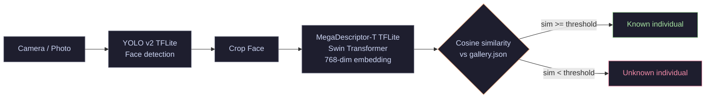

# OrangIdentifier - Android App


**Individual facial recognition for Bornean orangutans on the edge.** 
This is the offline Android companion app to the [OrangIdentifier ML Pipeline](https://github.com/tit0000/OrangIdentifier).

---

## Overview

The OrangIdentifier Android app brings the power of individual facial recognition directly to the field. Using a lightweight pipeline with **YOLO v2** for face detection and **MegaDescriptor-T** for identity embedding, it can identify orangutans in real-time or from saved media entirely offline on an Android device.

No internet connection is required once the application is installed.

> **ML Pipeline** → separate repository for training and creating the gallery JSON: [tit0000/OrangIdentifier](https://github.com/tit0000/OrangIdentifier)

---

## Demo


> Identifying individuals from live camera feed and saved gallery images.

---

## Features

- **Offline Inference**: Fully functional without an internet connection using on-device TensorFlow Lite models.
- **Media Processing**: Analyze photos and videos from your gallery to identify individuals.
- **Gallery Management**: Manage the identity gallery directly within the app, review known individuals.
- **Scan History**: Keep track of previous identifications with an embedded local database.
- **Add New Individuals**: Register new orangutans into the system directly from the app.

## Screenshots

| Home & Camera | Identification Result | Identity Gallery |
|:---:|:---:|:---:|
|  |  |  |

---

## Inference pipeline

The app executes a scaled-down version of the Python pipeline using TensorFlow Lite:



---

## Models Included

This application requires specific ML models in the `app/src/main/assets/` directory.

- `yolo_v2_detector.tflite` (**Included** - 22MB): Used for fast face detection.
- `megadesc_T_arcface_backbone.tflite` (**Not included** - 112MB): The heavy embedding model. **Must be downloaded separately.**

### Downloading the Backbone Model
Due to GitHub file size limits, the `megadesc_T_arcface_backbone.tflite` model is not included in the repository.

1. Download the model from the HuggingFace repo: [tit0000/OrangIdentifier](https://huggingface.co/tit0000/OrangIdentifier) (or from the Releases page).
2. Place it exactly at: `app/src/main/assets/megadesc_T_arcface_backbone.tflite` before building the app.

---

## Architecture

The app is built using modern Android development practices and Jetpack components:

- **Language**: Kotlin
- **Architecture**: Clean Architecture + MVVM (Model-View-ViewModel)
- **Dependency Injection**: Hilt
- **Database**: Room
- **Camera**: CameraX
- **Machine Learning**: TensorFlow Lite Android Support
- **Asynchronous Programming**: Coroutines & Flow

---

## Building the App

1. Clone this repository:
   ```bash
   git clone https://github.com/tit0000/OrangIdentifier-Android.git
   ```
2. Download the `megadesc_T_arcface_backbone.tflite` model and place it in `app/src/main/assets/`.
3. Open the project in **Android Studio** (Koala or newer recommended).
4. Sync Gradle files.
5. Build and run on your device or emulator.

---

## How to use custom galleries

The app ships with a sample `gallery.json` in the `assets/` folder. 
To use your own gallery:
1. Generate it using the [Python pipeline](https://github.com/tit0000/OrangIdentifier).
2. Replace `app/src/main/assets/gallery.json` before building, OR load it dynamically from the app settings.
